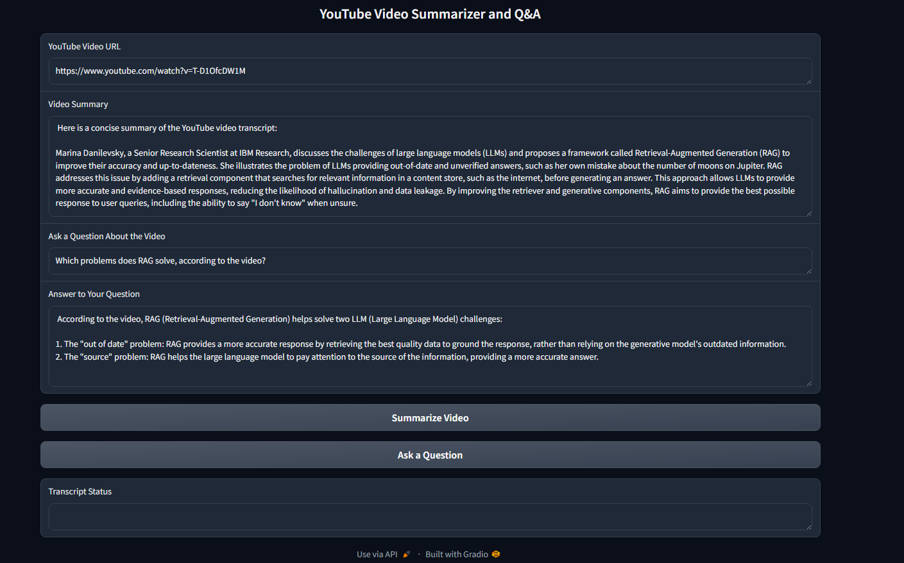

# 🎥 AI-Powered YouTube Summarizer & QA Tool

## 📌 Overview

This project is an AI-powered Question Answering (QA) and Summarization Tool for
YouTube videos. It leverages LangChain, FAISS, and IBM Watsonx LLMs to:

*  Extract transcripts from YouTube videos
*  Generate concise summaries
*  Answer user queries based on video content

With the explosion of online video content, manually searching through lengthy footage is
inefficient. This tool automates the process, making video content more accessible,
searchable, and insightful.

## ✨ Features

*  Transcript Extraction: Automatically fetches transcripts (manual or auto-generated) from YouTube videos.
    
*  Summarization: Generates concise, context-aware summaries of video transcripts.
    
*  Question Answering: Answers user queries based on the video’s content using Retrieval-Augmented Generation (RAG).
    
*  Chunking & Embeddings: Splits transcripts into manageable chunks and embeds them using IBM SLATE-30M embeddings.
    
*  Similarity Search with FAISS: Efficient retrieval of relevant transcript segments.
    
*  Interactive UI: Built with Gradio for a user-friendly web interface.

## 🛠 Tech Stack

*  Python 3.11+
*  LangChain (text processing, LLM orchestration)
*  FAISS (vector similarity search)
*  YouTube Transcript API (transcript extraction)
*  Gradio (web interface)
*  Streamlit (optional UI alternative)
*  IBM Watsonx.ai (LLMs & embeddings)

## ⚙️ Installation

1. Clone the repository

        git clone https://github.com/your-username/youtube-qa-bot.git
        cd youtube-qa-bot

2. Create and activate a virtual environment

        pip install virtualenv
        virtualenv my_env
        source my_env/bin/activate   # On Windows: my_env\Scripts\activate

3. Install dependencies

        pip install -r requirements.txt

## 🚀 Usage

### Run the application

        python ytbot.py

### Workflow

1. Enter a YouTube video URL.
2. Click "Summarize Video" to generate a summary.
3. Ask a question in the "Ask a Question" box.
4. Get context-aware answers powered by FAISS + LLM.

## 📂 Folder Structure

    youtube-qa-bot/
    │── ytbot.py                # Main application script
    │── requirements.txt        # Project dependencies
    │── README.md               # Project documentation
    │── CONTRIBUTING.md         # Contribution guidelines
    │── .gitignore              # Ignored files and folders
    │── /my_env                 # Virtual environment (ignored in .gitignore)

## 🧪 Testing the Application

You can test the tool with this sample video:

[RAG Introduction Video](https://www.youtube.com/watch?v=T-D1OfcDW1M)

Example interactions:

*  Summary: Generates a concise overview of the video.

*  Questions:

      *  "How does one reduce hallucinations?"
      *  "Which problems does RAG solve, according to the video?"

## 📸 Screenshots

Generated Summary and Q&A Example

## 📈 Next Steps / Enhancements

* Multi-language transcript support
* Sentiment analysis on video content
* Export summaries & answers as structured reports
* Streamlit-based dashboard alternative

## 👨‍💻 Authors

 Punyatoya Mohanty

## 📜 License

This project is licensed under the Punyatoya Mohanty's Non-Commercial License.
See the [LICENSE](LICENSE.md) file for details.

